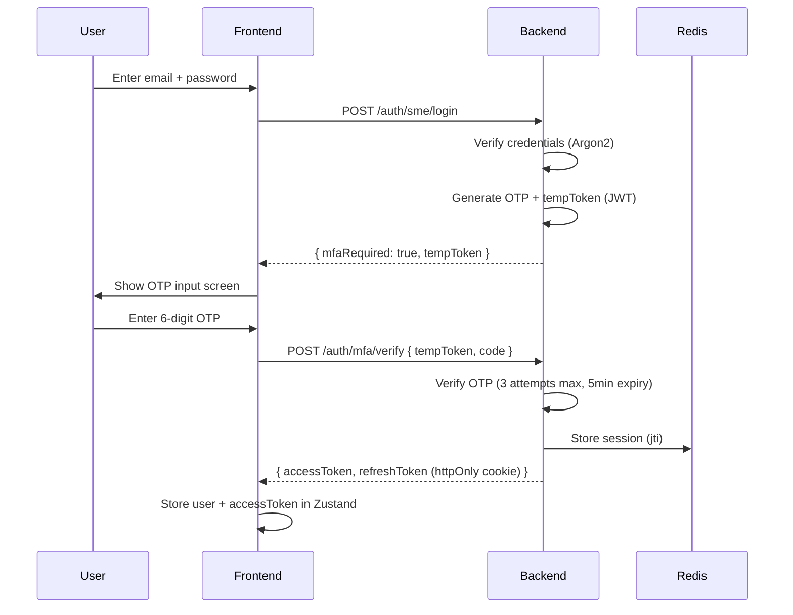
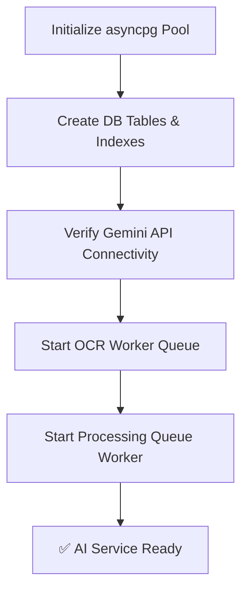
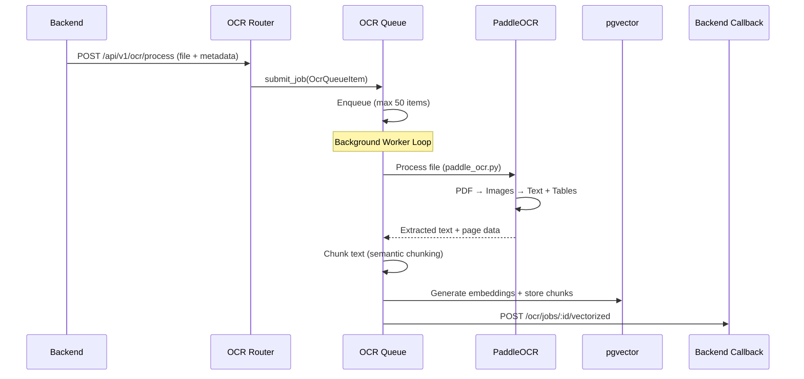
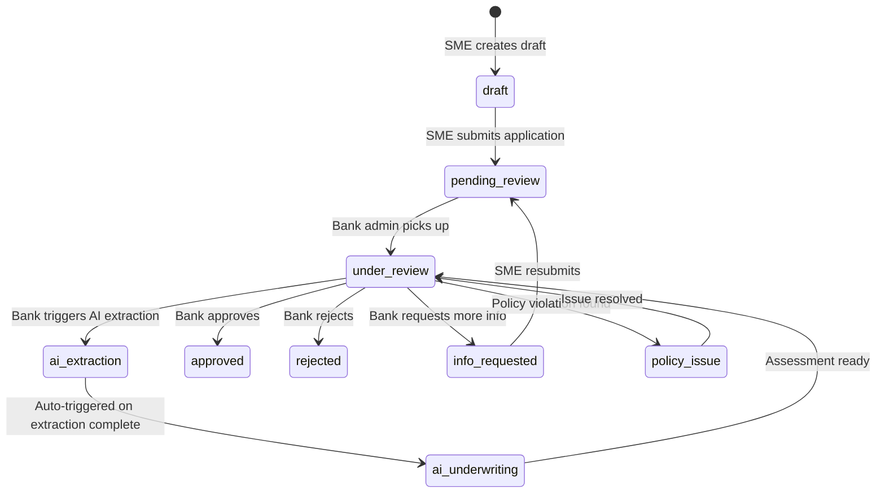

# CapitalScale — Comprehensive Project Analysis Report

> **AI-Powered SME Loan Underwriting Platform**
> Date: 30 July 2026 | Codebase Version: 1.0.0 (Backend) / 2.0.0 (AI Services)

---

## 1. Executive Summary

**CapitalScale** is a production-grade, AI-powered **SME (Small & Medium Enterprise) Loan Underwriting Platform** built as a full-stack monorepo. It automates the traditionally manual, time-consuming process of evaluating SME loan applications by leveraging **OCR document processing**, **LLM-based parameter extraction**, **RAG (Retrieval-Augmented Generation) chat**, and **AI credit underwriting** — all orchestrated through a three-tier microservices architecture.

### Core Value Proposition

| Problem | CapitalScale Solution |
|---|---|
| Manual document review takes days | PaddleOCR extracts text from PDFs/images in seconds |
| Underwriters miss financial data across docs | LLM extracts 30+ financial parameters automatically |
| Bank policy compliance is subjective | AI evaluates every extracted parameter against bank-specific rules |
| Communication gaps between banks & SMEs | Real-time status tracking, MFA-secured portals for both roles |
| No audit trail for decisions | Every action logged with full audit history |

---

## 2. Architecture Overview

The platform follows a **three-tier microservices architecture** deployed as a monorepo with npm workspaces:

```mermaid
graph TD
    subgraph "Frontend — React + Vite (Port 3000)"
        FE[React 18 SPA]
        FE_AUTH[AuthContext + Zustand Store]
        FE_API[Axios API Client Layer]
    end

    subgraph "Backend — Express.js (Port 5000)"
        BE_MW[Middleware: Helmet, CORS, RateLimiter, Auth]
        BE_ROUTES[Versioned Routes: /api/v1/*]
        BE_CTRL[Controllers: Auth, Loan, OCR, Extraction, Underwriting, Bank, Policy, AuditLog]
        BE_SVC[Services: Business Logic Layer]
        BE_REPO[Repositories: Data Access Layer]
    end

    subgraph "AI Services — FastAPI/Python (Port 5001)"
        AI_OCR[PaddleOCR Queue Worker]
        AI_EXTRACT[Parameter Extraction Service]
        AI_UW[Underwriting Assessment Engine]
        AI_CHAT[RAG Chat Engine]
        AI_VDB[pgvector Store + Reranker]
        AI_LLM[LLM Facade: Gemini + OpenAI]
    end

    subgraph "Data Layer"
        SUPA[(Supabase / PostgreSQL)]
        REDIS[(Redis: Sessions + Token Blacklist)]
        CLOUD[(Cloudinary: File Storage)]
        PGVEC[(pgvector: Embeddings)]
    end

    FE --> |HTTP/REST| BE_ROUTES
    FE_API --> |Bearer JWT| BE_MW
    BE_SVC --> |HTTP/REST| AI_OCR
    BE_SVC --> |HTTP/REST| AI_EXTRACT
    BE_SVC --> |HTTP/REST| AI_UW
    BE_CTRL --> |HTTP/REST| AI_CHAT
    BE_REPO --> SUPA
    BE_MW --> REDIS
    BE_SVC --> CLOUD
    AI_VDB --> PGVEC
    AI_LLM --> |API| Gemini/OpenAI
    AI_OCR --> |Callback| BE_ROUTES
```



---

## 3. Technology Stack (Detailed)

### 3.1 Frontend

| Technology | Version | Purpose |
|---|---|---|
| [React](file:///e:/Desktop/Web%20Development/CapitalScale/frontend/package.json) | 18.3.1 | Core UI framework |
| Vite | 5.2.13 | Build tool & dev server |
| Tailwind CSS | 3.4.4 | Utility-first styling |
| shadcn/ui (Radix) | Multiple | Accessible UI component primitives |
| Zustand | 4.5.2 | Lightweight global state management |
| React Router DOM | 6.23.1 | Client-side routing |
| Axios | 1.7.2 | HTTP client with interceptors |
| React Hook Form | 7.52.0 | Form state management |
| Lucide React | 0.395.0 | Icon library |
| React Markdown | 10.1.0 | Markdown rendering (for AI chat responses) |

### 3.2 Backend

| Technology | Version | Purpose |
|---|---|---|
| [Express.js](file:///e:/Desktop/Web%20Development/CapitalScale/backend/package.json) | 4.19.2 | HTTP framework |
| Supabase JS | 2.108.2 | PostgreSQL client via Supabase |
| Argon2 | 0.44.0 | Password hashing (memory-hard) |
| JSON Web Token | 9.0.2 | JWT generation & verification |
| ioredis | 5.11.1 | Redis client for sessions |
| Cloudinary | 2.2.0 | Cloud file storage |
| Multer | 2.0.0 | Multipart file upload handling |
| Zod | 3.23.8 | Runtime validation (env + request schemas) |
| Helmet | 7.1.0 | Security headers |
| Winston | 3.13.0 | Structured JSON logging with daily rotation |
| Morgan | 1.10.0 | HTTP request logging |
| express-rate-limit | 7.3.1 | API rate limiting |

### 3.3 AI Services (Python)

| Technology | Purpose |
|---|---|
| [FastAPI](file:///e:/Desktop/Web%20Development/CapitalScale/ai-services-python/main.py) | Async HTTP framework |
| asyncpg | PostgreSQL async driver (connection pooling) |
| PaddleOCR v4 | Document OCR (text extraction from images/PDFs) |
| Google Gemini (gemini-1.5-pro, gemini-2.5-flash) | Primary LLM for chat, extraction, underwriting |
| OpenAI (gpt-4o-mini) | Fallback LLM provider |
| text-embedding-004 (Gemini) | 768-dimensional text embeddings |
| pgvector | Vector similarity search in PostgreSQL |
| cross-encoder/ms-marco-MiniLM-L-6-v2 | Cross-encoder reranker for RAG retrieval |
| Pydantic / Pydantic Settings | Configuration validation |
| Loguru | Structured logging with rotation |
| Uvicorn | ASGI server |

### 3.4 Infrastructure

| Component | Technology |
|---|---|
| Database | PostgreSQL (Supabase-hosted) |
| Vector Store | pgvector extension on same PostgreSQL |
| Session Store | Redis 7 Alpine |
| File Storage | Cloudinary |
| Containerization | Docker + Docker Compose |
| Cloud Deployment | Render.com (Docker-based) + Vercel (Frontend) |

---

## 4. Detailed Module Breakdown

### 4.1 Frontend Application

#### 4.1.1 Routing & Pages

The application is a **Single Page Application (SPA)** with role-based routing defined in [App.jsx](file:///e:/Desktop/Web%20Development/CapitalScale/frontend/src/App.jsx):

| Route | Page | Access |
|---|---|---|
| `/` / `/login` | [LoginPage](file:///e:/Desktop/Web%20Development/CapitalScale/frontend/src/pages/LoginPage.jsx) | Public — role selection portal |
| `/sme/login` | [SMELoginPage](file:///e:/Desktop/Web%20Development/CapitalScale/frontend/src/pages/SMELoginPage.jsx) | Public — SME applicant login |
| `/sme/register` | [SMERegisterPage](file:///e:/Desktop/Web%20Development/CapitalScale/frontend/src/pages/SMERegisterPage.jsx) | Public — SME registration |
| `/bank/login` | [BankAdminLoginPage](file:///e:/Desktop/Web%20Development/CapitalScale/frontend/src/pages/BankAdminLoginPage.jsx) | Public — Bank admin login |
| `/bank/register` | [BankAdminRegisterPage](file:///e:/Desktop/Web%20Development/CapitalScale/frontend/src/pages/BankAdminRegisterPage.jsx) | Public — Bank admin registration |
| `/dashboard` | [DashboardPage](file:///e:/Desktop/Web%20Development/CapitalScale/frontend/src/pages/DashboardPage.jsx) → [SMEDashboard](file:///e:/Desktop/Web%20Development/CapitalScale/frontend/src/pages/SMEDashboard.jsx) or [BankAdminDashboard](file:///e:/Desktop/Web%20Development/CapitalScale/frontend/src/pages/BankAdminDashboard.jsx) | Protected — role-adaptive |
| `/loan/apply` | [LoanApplicationPage](file:///e:/Desktop/Web%20Development/CapitalScale/frontend/src/pages/LoanApplicationPage.jsx) | Protected — SME only |
| `/unauthorized` | [UnauthorizedPage](file:///e:/Desktop/Web%20Development/CapitalScale/frontend/src/pages/UnauthorizedPage.jsx) | Public |

#### 4.1.2 Authentication Flow

The auth system uses a **two-phase MFA flow** managed by [AuthContext](file:///e:/Desktop/Web%20Development/CapitalScale/frontend/src/context/AuthContext.jsx) + [authStore](file:///e:/Desktop/Web%20Development/CapitalScale/frontend/src/store/authStore.js) (Zustand with persistence):



**Key security features:**
- **Argon2** password hashing (memory-hard, resistant to GPU attacks)
- **MFA via email OTP** with 5-minute expiry and 3-attempt lockout
- **JWT access tokens** (short-lived) + **Refresh tokens** (httpOnly cookies, 30-day)
- **Redis session tracking** — each JWT is tied to a server-side session
- **Refresh token rotation** — old token blacklisted on each refresh
- **Token reuse detection** — reused refresh tokens trigger fraud audit log

#### 4.1.3 API Client Architecture

The [apiClient](file:///e:/Desktop/Web%20Development/CapitalScale/frontend/src/api/apiClient.js) implements a sophisticated Axios instance with:

- **Request interceptor**: Auto-attaches `Bearer` token from Zustand store
- **Response interceptor**: Handles 401s with automatic token refresh
- **Concurrent request queue**: While refreshing, queues parallel failed requests and replays them with the new token
- **Auto-redirect**: On refresh failure, clears auth state and redirects to `/login`

#### 4.1.4 API Modules

| Module | File | Endpoints |
|---|---|---|
| Auth | [auth.api.js](file:///e:/Desktop/Web%20Development/CapitalScale/frontend/src/api/auth.api.js) | SME/Bank login, register, MFA verify, refresh, logout |
| Loans | [loan.api.js](file:///e:/Desktop/Web%20Development/CapitalScale/frontend/src/api/loan.api.js) | CRUD, drafts, document upload, submit, status change, chat, history |
| Banks | [bank.api.js](file:///e:/Desktop/Web%20Development/CapitalScale/frontend/src/api/bank.api.js) | Account linking (OTP-based), policy management, policy chat |
| Underwriting | [underwriting.api.js](file:///e:/Desktop/Web%20Development/CapitalScale/frontend/src/api/underwriting.api.js) | AI assessment, report, re-evaluation, rule inventory, audit logs |
| Extraction | [extraction.api.js](file:///e:/Desktop/Web%20Development/CapitalScale/frontend/src/api/extraction.api.js) | Trigger extraction, get results |
| Audit Logs | [auditLog.api.js](file:///e:/Desktop/Web%20Development/CapitalScale/frontend/src/api/auditLog.api.js) | View audit trail |

---

### 4.2 Backend (Express.js)

#### 4.2.1 Application Bootstrap

The server starts in [server.js](file:///e:/Desktop/Web%20Development/CapitalScale/backend/server.js):

1. **Loads environment** via `dotenv/config`
2. **Validates all env vars** using [Zod schema](file:///e:/Desktop/Web%20Development/CapitalScale/backend/src/config/env.js) (fails fast on invalid config)
3. **Initializes Supabase client** ([supabaseClient.js](file:///e:/Desktop/Web%20Development/CapitalScale/backend/src/db/supabaseClient.js))
4. **Initializes Cloudinary** for file uploads
5. **Creates Express app** with full middleware stack ([app.js](file:///e:/Desktop/Web%20Development/CapitalScale/backend/src/app.js))
6. **Starts HTTP server** on configured port (default 5000)
7. **Sets server timeout** to 600s (10 minutes — for long OCR/AI operations)
8. **Graceful shutdown** handlers for SIGTERM/SIGINT

#### 4.2.2 Middleware Pipeline

Applied in order in [app.js](file:///e:/Desktop/Web%20Development/CapitalScale/backend/src/app.js):

| Order | Middleware | File | Purpose |
|---|---|---|---|
| 1 | Helmet | Built-in | Security headers (CSP, HSTS, etc.) |
| 2 | CORS | Built-in | Origin whitelist with credentials support |
| 3 | Body Parser | Built-in | JSON + URL-encoded (10MB limit) |
| 4 | Cookie Parser | Built-in | Parse httpOnly cookies (refresh tokens) |
| 5 | Request Logger | [requestLogger.js](file:///e:/Desktop/Web%20Development/CapitalScale/backend/src/middleware/requestLogger.js) | Morgan HTTP access logs |
| 6 | Rate Limiter | [rateLimiter.js](file:///e:/Desktop/Web%20Development/CapitalScale/backend/src/middleware/rateLimiter.js) | 100 req/15min per IP (configurable) |
| 7 | Router | [routes/index.js](file:///e:/Desktop/Web%20Development/CapitalScale/backend/src/routes/index.js) | All versioned API routes |
| 8 | 404 Handler | Inline | Catch-all for undefined routes |
| 9 | Error Handler | [errorHandler.js](file:///e:/Desktop/Web%20Development/CapitalScale/backend/src/middleware/errorHandler.js) | Centralized error formatting |

#### 4.2.3 API Routes (v1)

All routes are prefixed with `/api/v1/` and defined in [routes/v1/](file:///e:/Desktop/Web%20Development/CapitalScale/backend/src/routes/v1):

| Route Group | Key Endpoints | Auth Required |
|---|---|---|
| `/auth` | `POST /sme/register`, `POST /sme/login`, `POST /bank/register`, `POST /bank/login`, `POST /mfa/verify`, `POST /refresh`, `POST /logout`, `GET /me` | Varies |
| `/loans` | `GET /`, `POST /`, `GET /:id`, `PATCH /:id`, `DELETE /:id`, `POST /draft`, `PUT /draft/:id`, `POST /draft/:id/submit`, `POST /draft/:id/upload`, `DELETE /draft/:id/upload/:docType`, `POST /:id/status`, `GET /:id/history`, `POST /draft/:id/chat` | SME / Bank Admin |
| `/banks` | `GET /accounts`, `POST /otp/send`, `POST /otp/verify`, `DELETE /accounts/:id` | SME |
| `/bank-policies` | `GET /`, `POST /`, `PUT /:id`, `DELETE /:id`, `POST /:id/extract` | Bank Admin |
| `/ocr` | `POST /upload`, `GET /jobs/:jobId`, `GET /jobs`, `POST /retry/:jobId`, `GET /stats`, `GET /jobs/:jobId/full`, `PATCH /jobs/:jobId/vectorized` | Auth |
| `/extraction` | `POST /loans/:loanId/extract`, `POST /loans/:loanId/re-extract`, `GET /loans/:loanId/result`, `POST /loans/:loanId/extraction-status`, `POST /loans/:loanId/missing-info` | Bank Admin |
| `/underwriting` | `POST /loans/:loanId/assess`, `GET /loans/:loanId/report`, `POST /loans/:loanId/reevaluate`, `POST /loans/:loanId/notify-policy-issue`, `GET /queue/status/:jobId`, `GET /inventory/:bankName`, `GET /loans/:loanId/audit-logs` | Bank Admin |
| `/audit-logs` | `GET /` | Bank Admin / Super Admin |

#### 4.2.4 RBAC (Role-Based Access Control)

Defined in [auth middleware](file:///e:/Desktop/Web%20Development/CapitalScale/backend/src/middleware/auth.js):

| Role | Identifier | Access Level |
|---|---|---|
| SME Applicant | `sme` | Loan applications, document upload, own dashboard |
| Bank Administrator | `bank_admin` | Loan review, AI assessment, policy management, audit logs |
| Super Administrator | `super_admin` | Full system access |

**Convenience middleware combos:**
- `requireSME` = `protect` + `authorizeRoles('sme')`
- `requireBankAdmin` = `protect` + `authorizeRoles('bank_admin')`
- `requireBankOrSuper` = `protect` + `authorizeRoles('bank_admin', 'super_admin')`
- `requireAuth` = `protect` only (any authenticated user)

The system also supports **permission-based authorization** (`authorizePermissions`) via role-permission mappings stored in the database and cached in Redis sessions.

#### 4.2.5 Controller → Service → Repository Pattern

The backend follows a strict **layered architecture**:

```
Controller (thin HTTP handler)
    └── Service (business logic)
        └── Repository / DB Queries (data access)
            └── Supabase Client (PostgreSQL)
```

**Controllers** ([controllers/](file:///e:/Desktop/Web%20Development/CapitalScale/backend/src/controllers)):
- Parse request parameters
- Delegate to services
- Format responses using `ApiResponse` utility
- Record audit logs (fire-and-forget with `.catch(() => {})`)

**Services** ([services/](file:///e:/Desktop/Web%20Development/CapitalScale/backend/src/services)):
- Contain all business logic
- Orchestrate between multiple repositories and external services
- Handle authorization checks
- Communicate with AI Services via HTTP (Axios)

**Database Queries** ([db/queries/](file:///e:/Desktop/Web%20Development/CapitalScale/backend/src/db/queries)):
- Raw Supabase queries organized by entity
- 8 query modules: `users`, `loans`, `ocrJobs`, `policies`, `bankAccounts`, `embeddings`, `otps`, `auditLogs`

---

### 4.3 AI Services (Python FastAPI)

This is the **AI/ML brain** of the platform, defined in [main.py](file:///e:/Desktop/Web%20Development/CapitalScale/ai-services-python/main.py).

#### 4.3.1 Startup Lifecycle



On startup, the service:
1. Creates an **asyncpg connection pool** (min 5, max 20 connections) — [database.py](file:///e:/Desktop/Web%20Development/CapitalScale/ai-services-python/config/database.py)
2. Ensures **pgvector extension** is installed
3. Creates all required tables (if missing): `loan_processing_jobs`, `query_embedding_cache`, `policy_rules`, `policy_extraction_audit`, `underwriting_audit_logs`, `rule_relationships`
4. Creates **RAG indexes** on `document_embeddings` (HNSW for vectors, GIN for trigrams, btree for lookups)
5. **Pings Gemini API** to verify connectivity
6. **Starts the OCR background worker** for processing document scans
7. **Starts the Processing Queue** for extraction + underwriting jobs

#### 4.3.2 OCR Pipeline

The OCR pipeline processes uploaded documents through [ocr_queue.py](file:///e:/Desktop/Web%20Development/CapitalScale/ai-services-python/services/ocr/ocr_queue.py):



**Key OCR features:**
- **PaddleOCR v4** for text recognition (supports multi-language)
- **PDF to image conversion** at 200 DPI
- **Image enhancement** (optional)
- **Table extraction** support
- **Queue-based processing** with max 50 concurrent items
- **Automatic vectorization** — text chunks are embedded and stored in pgvector
- **Callback mechanism** — notifies backend on completion

#### 4.3.3 Parameter Extraction Pipeline

The extraction service ([extraction_service.py](file:///e:/Desktop/Web%20Development/CapitalScale/ai-services-python/services/extraction/extraction_service.py), ~26KB) extracts structured financial parameters from loan documents:

**Extraction workflow:**
1. **Retrieval**: Queries pgvector for relevant document chunks using semantic search
2. **First Pass**: LLM (Gemini 1.5 Pro) extracts ~30+ parameters from retrieved context
3. **Verification Agent** (optional): A second LLM pass to verify extracted values against source documents
4. **Second Pass** (optional): Targeted re-extraction for any parameters with low confidence
5. **Result Storage**: Saves structured extraction results to `extracted_parameters` table

**Extracted parameters include:**
- GSTIN, PAN, business registration details
- Annual turnover, net profit, operating profit margins
- DSCR (Debt Service Coverage Ratio)
- Collateral details
- Business vintage
- Credit score indicators
- And many more financial metrics

**Advanced features:**
- **Two-stage retrieval**: Candidate retrieval (top 40) → Cross-encoder reranking (top 10)
- **Confidence scoring** per parameter
- **Missing field detection** with callback to backend
- **Caching** to avoid redundant extractions
- **Configurable context window** (max 24,000 chars)

#### 4.3.4 AI Underwriting Assessment

The underwriting engine ([underwriting_service.py](file:///e:/Desktop/Web%20Development/CapitalScale/ai-services-python/services/underwriting/underwriting_service.py), ~18KB) evaluates loan applications against bank-specific policies:

**Assessment workflow:**
1. **Load extracted parameters** from the extraction pipeline
2. **Retrieve active policy rules** for the applicant's bank from `policy_rules` table
3. **Construct evaluation prompt** with parameters + rules
4. **LLM evaluates** each rule against extracted data
5. **Generate risk score** (0-100) and decision (Approve/Reject/Refer)
6. **Store assessment** + **audit log** to database

**Output includes:**
- Overall risk score
- Decision recommendation (Approve / Reject / Refer to committee)
- Confidence level
- Per-rule evaluation results (pass/fail/inconclusive with reasoning)
- Missing data flags

#### 4.3.5 Policy Management Engine

The policy service ([policy_service.py](file:///e:/Desktop/Web%20Development/CapitalScale/ai-services-python/services/underwriting/policy_service.py), ~21KB) handles bank-specific underwriting policy rules:

- **Policy PDF Processing**: Bank admins upload policy PDFs → OCR → Text extraction → Chunked + embedded
- **Rule Extraction**: LLM reads policy chunks and extracts discrete underwriting rules
- **Rule Storage**: Rules stored in `policy_rules` table with metadata (category, priority, section, page)
- **Rule Relationships**: Parent-child, dependency, and exception relationships between rules (`rule_relationships` table)
- **Audit Trail**: Every extraction logged in `policy_extraction_audit`

#### 4.3.6 RAG Chat System

The chat engine ([chat.py](file:///e:/Desktop/Web%20Development/CapitalScale/ai-services-python/routers/chat.py)) provides two conversational interfaces:

**1. Loan Document Chat** (`/api/v1/chat/loan/{application_id}`)
- Bank admins ask questions about a specific loan's documents
- Uses semantic search against the loan's embedded document chunks
- Strictly grounded — AI only answers from provided context

**2. Policy Chat** (`/api/v1/chat/policy/{bank_id}`)
- Bank admins ask questions about their credit underwriting policies
- Uses **retrieve-and-rerank** pipeline (cross-encoder reranking)
- Includes detailed few-shot prompting for strict grounding

**Chat features:**
- **Structured JSON output** with `answer`, `reasoning`, and `found_in_context` flag
- **Source attribution** — returns document names and page numbers
- **Rate limit handling** with retry-after headers
- **Retrieval metric logging** for monitoring and evaluation

#### 4.3.7 Processing Queue (Job Scheduler)

The [processing_queue.py](file:///e:/Desktop/Web%20Development/CapitalScale/ai-services-python/services/processing_queue.py) is a **single-threaded, priority-based job queue** for long-running AI tasks:

| Feature | Detail |
|---|---|
| **Sequential processing** | One job at a time to respect LLM rate limits |
| **Priority ordering** | Higher priority jobs execute first |
| **Job types** | `extraction`, `underwriting`, `full_pipeline` |
| **Preemption** | Admin can cancel current job and promote their own |
| **Status tracking** | `pending` → `running` → `completed` / `failed` / `paused` |
| **Error handling** | Failed jobs recorded with error message |
| **Persistence** | Jobs stored in `loan_processing_jobs` PostgreSQL table |

The `full_pipeline` job type chains extraction → underwriting automatically.

#### 4.3.8 LLM Facade & Rate Limiting

The [llm_facade.py](file:///e:/Desktop/Web%20Development/CapitalScale/ai-services-python/services/llm/llm_facade.py) provides a unified interface with **centralized rate limiting**:

- **Single shared rate limiter** for all LLM calls (OCR embedding, extraction, underwriting, chat)
- **Provider abstraction** via [providers/](file:///e:/Desktop/Web%20Development/CapitalScale/ai-services-python/services/llm/providers):
  - [gemini.py](file:///e:/Desktop/Web%20Development/CapitalScale/ai-services-python/services/llm/providers/gemini.py) — Primary provider (Gemini 1.5 Pro + 2.5 Flash)
  - [openai.py](file:///e:/Desktop/Web%20Development/CapitalScale/ai-services-python/services/llm/providers/openai.py) — Fallback (GPT-4o-mini)
  - [base.py](file:///e:/Desktop/Web%20Development/CapitalScale/ai-services-python/services/llm/providers/base.py) — Abstract base class

**Rate limiter** ([rate_limiter.py](file:///e:/Desktop/Web%20Development/CapitalScale/ai-services-python/services/llm/rate_limiter.py)):
- Manages Gemini free tier quota (~15 req/min)
- Async token-bucket algorithm
- Health check pings are exempt

#### 4.3.9 Vector Database (pgvector)

The [pgvector_service.py](file:///e:/Desktop/Web%20Development/CapitalScale/ai-services-python/services/vectordb/pgvector_service.py) manages vector storage and retrieval:

| Function | Description |
|---|---|
| `store_chunks()` | Batch-insert text chunks with 768-dim embeddings |
| `query_similar_chunks()` | Cosine similarity search filtered by application_id |
| `retrieve_and_rerank()` | Two-stage: vector search → cross-encoder reranking |
| `get_embedding_stats()` | Aggregate statistics for health checks |

**Indexes maintained** (from [database.py](file:///e:/Desktop/Web%20Development/CapitalScale/ai-services-python/config/database.py)):
- `idx_doc_emb_application_id` (btree)
- `idx_doc_emb_app_doctype` (composite btree)
- `idx_doc_emb_source_document` (btree)
- `idx_doc_emb_vector_hnsw` (HNSW with m=16, ef_construction=64)
- `idx_doc_emb_chunk_text_trgm` (GIN trigram for text search)
- `idx_doc_emb_structured_facts` (GIN on JSONB metadata)

---

## 5. Database Schema

The platform uses **PostgreSQL via Supabase** with the following key tables:

### Core Tables (Managed by Backend / Supabase)

| Table | Purpose |
|---|---|
| `sme_users` | SME applicant accounts |
| `bank_admin_users` | Bank administrator accounts |
| `roles` | RBAC role definitions |
| `role_permissions` | Permission mappings per role |
| `loans` | Loan applications with status, documents, AI results |
| `bank_accounts` | SME-linked bank accounts (OTP-verified) |
| `bank_policy_documents` | Uploaded bank policy PDF metadata |
| `otps` | MFA verification codes (email OTP) |
| `audit_logs` | Full platform audit trail |
| `ocr_jobs` | OCR processing job tracking |

### AI Tables (Managed by Python Service)

| Table | Purpose |
|---|---|
| `document_embeddings` | Vectorized document chunks (pgvector) |
| `extracted_parameters` | AI-extracted financial parameters per loan |
| `loan_processing_jobs` | Processing queue state (extraction/underwriting jobs) |
| `query_embedding_cache` | Cached query embeddings to avoid redundant API calls |
| `policy_rules` | Extracted underwriting rules per bank |
| `policy_extraction_audit` | Audit trail for policy rule extraction |
| `underwriting_audit_logs` | Detailed AI assessment audit records |
| `rule_relationships` | Inter-rule dependencies and hierarchy |

---

## 6. End-to-End Workflow: Loan Application Lifecycle



### Step-by-step:

1. **SME Registration** → Creates account with MFA verification
2. **Create Loan Draft** → SME selects a partner bank, creates draft application
3. **Fill Application** → SME enters business details, financials
4. **Upload Documents** → PDFs/images uploaded to Cloudinary, OCR queued automatically
5. **Submit Application** → Status transitions to `pending_review`
6. **Bank Admin Review** → Bank admin sees application in dashboard
7. **AI Extraction** → Bank admin triggers extraction → Queue job runs → Parameters extracted
8. **AI Underwriting** → Auto-triggered after extraction → Risk score + decision generated
9. **Review Assessment** → Bank admin reviews AI report, asks questions via chat
10. **Decision** → Bank admin approves, rejects, or requests more information
11. **Audit Trail** → Every action recorded with actor, timestamp, IP, user agent

---

## 7. Security Architecture

| Layer | Mechanism |
|---|---|
| **Password Storage** | Argon2id (memory-hard hash) |
| **Authentication** | JWT (access + refresh) with MFA (email OTP) |
| **Session Management** | Redis-backed sessions with token rotation |
| **Token Security** | Refresh token blacklisting + reuse detection |
| **API Security** | Helmet headers, CORS whitelist, rate limiting |
| **Input Validation** | Zod schemas (backend), Pydantic models (AI services) |
| **File Uploads** | Multer with size limits, MIME type validation |
| **RBAC** | Role-based + permission-based access control |
| **Audit Logging** | Every action logged with IP, user agent, actor |
| **Cookie Security** | httpOnly, secure, sameSite for refresh tokens |

---

## 8. Deployment Architecture

### Docker Compose (Development)

Defined in [docker-compose.yml](file:///e:/Desktop/Web%20Development/CapitalScale/docker-compose.yml):

| Service | Container | Port | Notes |
|---|---|---|---|
| Redis | `ai_loan_redis` | 6379 | Session store & token blacklist |
| Backend | `ai_loan_backend` | 5000 | Node.js + Express |
| AI Services | `ai_loan_ai_services` | 5001 | Python + FastAPI + PaddleOCR |
| Frontend | `ai_loan_frontend` | 3000 | Vite dev server |

### Production

| Service | Platform |
|---|---|
| Frontend | **Vercel** (capitalscale.vercel.app) |
| Backend | **Render.com** or similar |
| AI Services | **Render.com** (Docker-based) — [render.yaml](file:///e:/Desktop/Web%20Development/CapitalScale/render.yaml) |
| Database | **Supabase** (managed PostgreSQL + pgvector) |
| File Storage | **Cloudinary** |
| Redis | Managed Redis provider |

---

## 9. Project Statistics

| Metric | Value |
|---|---|
| **Total tiers** | 3 (Frontend, Backend, AI Services) |
| **Backend controllers** | 8 |
| **Backend services** | 7 |
| **Backend middleware** | 6 |
| **Backend DB query modules** | 8 |
| **Backend API route groups** | 9 |
| **AI service routers** | 6 |
| **AI service modules** | 7+ (OCR, Extraction, Underwriting, RAG, Vector DB, LLM, Queue) |
| **Frontend pages** | 10 |
| **Frontend API modules** | 7 |
| **LLM providers** | 2 (Gemini primary, OpenAI fallback) |
| **Database tables** | ~18 |
| **Docker services** | 4 |
| **Largest frontend file** | BankAdminDashboard.jsx (154KB) |
| **Largest AI service file** | extraction_service.py (26.6KB) |

---

## 10. Key Design Decisions & Patterns

| Decision | Rationale |
|---|---|
| **Monorepo with npm workspaces** | Single repo for frontend, backend, AI — simpler CI/CD |
| **Supabase over raw Postgres** | Managed auth, realtime, built-in RLS; faster to ship |
| **asyncpg over SQLAlchemy** | Raw async driver = lower overhead for high-throughput AI workloads |
| **Sequential processing queue** | Prevents LLM rate limit exhaustion; ensures deterministic execution |
| **Cross-encoder reranking** | Dramatically improves RAG retrieval quality for policy chat |
| **Fire-and-forget audit logs** | `.catch(() => {})` ensures audit failures never block user operations |
| **Centralized rate limiter** | Single throttle point for all LLM calls prevents quota exhaustion |
| **Zustand over Redux** | Minimal boilerplate for auth state; persisted to localStorage |
| **Argon2 over bcrypt** | Memory-hard = resistant to GPU/ASIC brute-force attacks |
| **Structured JSON LLM output** | Forces model to return parseable JSON with `found_in_context` flag for grounding |

---

## 11. Summary

CapitalScale is a **sophisticated, production-ready platform** that digitizes and automates the SME loan underwriting process. It combines:

- **Modern web technologies** (React, Express, FastAPI) for a responsive user experience
- **AI/ML capabilities** (PaddleOCR, Gemini LLM, pgvector RAG) for intelligent document processing
- **Enterprise-grade security** (MFA, JWT rotation, RBAC, audit logging) for regulatory compliance
- **Scalable architecture** (Docker, managed cloud services, async processing queues) for production workloads

The three-tier design cleanly separates concerns: the frontend handles user interaction, the backend manages business logic and authorization, and the AI service focuses purely on ML workloads — making each tier independently scalable and maintainable.
