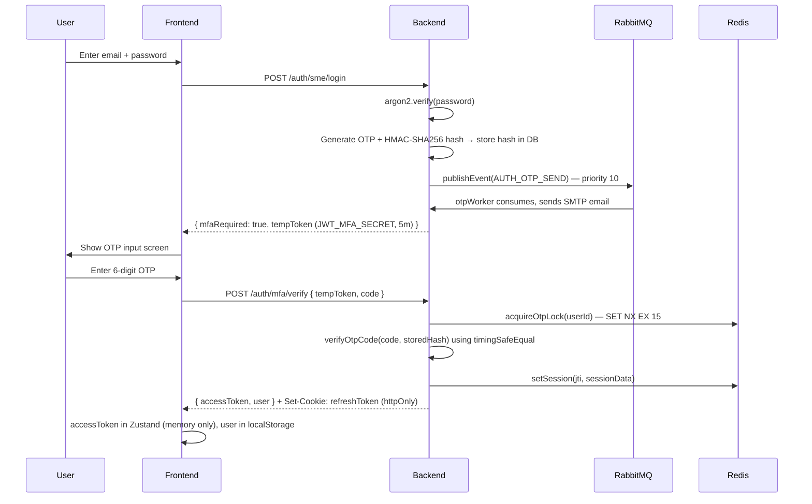
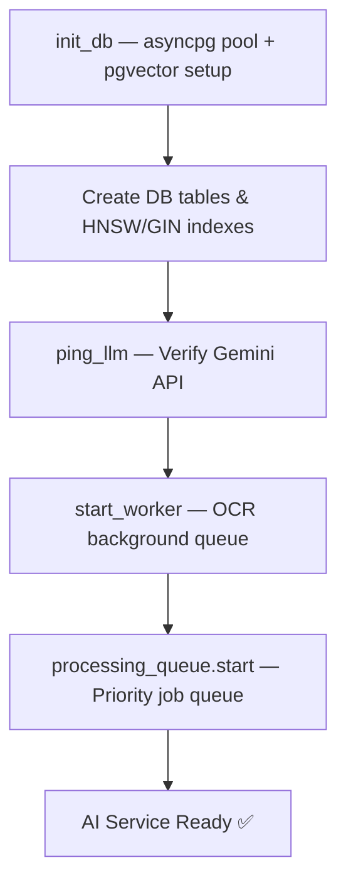
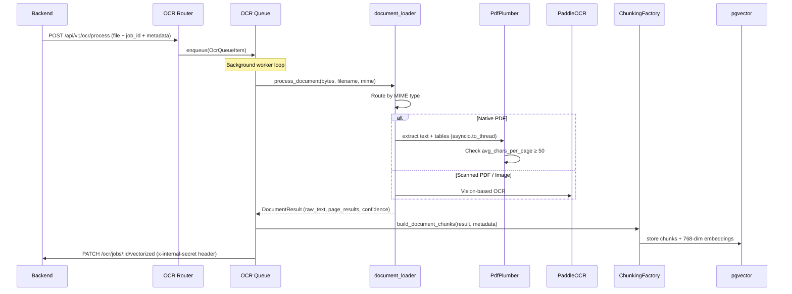
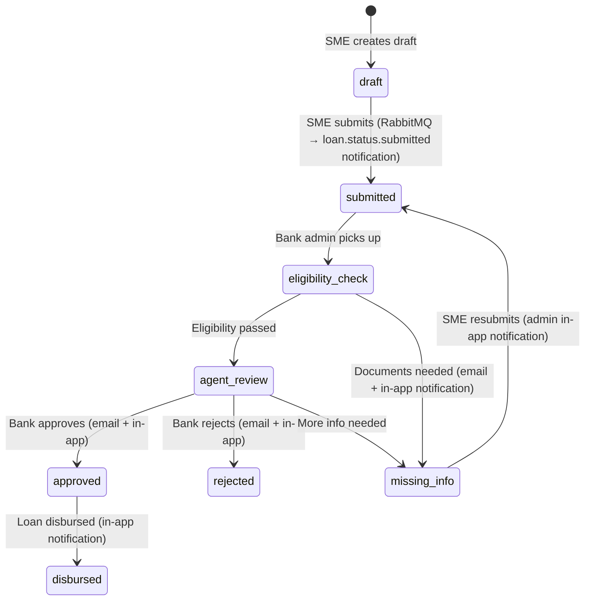

# CapitalScale — Comprehensive Project Analysis Report

> **AI-Powered SME Loan Underwriting Platform**
> Date: 01 August 2026 | Codebase Scan: Complete

---

## 1. Executive Summary

**CapitalScale** is a production-grade, AI-powered **SME (Small & Medium Enterprise) Loan Underwriting Platform** built as a full-stack monorepo. It automates the traditionally manual, time-consuming process of evaluating SME loan applications by leveraging:

- **PaddleOCR + pdfplumber** for document text extraction
- **Domain-aware RAG chunking strategies** for financial document intelligence
- **Google Gemini LLM** for 30+ parameter extraction, underwriting assessment, and conversational Q&A
- **RabbitMQ event-driven notifications** (OTP, loan status emails, in-app alerts)
- **Server-Sent Events (SSE) + Redis Pub/Sub** for real-time, horizontally-scalable frontend push

### Core Value Proposition

| Problem | CapitalScale Solution |
|---|---|
| Manual document review takes days | PaddleOCR + pdfplumber extracts text from PDFs/images in seconds |
| Underwriters miss financial data across docs | LLM extracts 30+ financial parameters automatically with confidence scoring |
| Bank policy compliance is subjective | AI evaluates every parameter against bank-specific underwriting rules |
| Communication gaps between banks & SMEs | Real-time SSE notifications + email templates for every loan status change |
| OTP delivery is unreliable | RabbitMQ `otp_queue` (priority 10) with retry logic (up to 10 attempts) and Dead Letter Queue |
| No audit trail for decisions | Every action logged with IP, user agent, actor ID, and timestamp |

---

## 2. Architecture Overview

The platform follows a **three-tier microservices architecture** deployed as a monorepo with npm workspaces:

```mermaid
graph TD
    subgraph "Frontend — React + Vite (Port 3000)"
        FE[React 18 SPA]
        FE_AUTH[AuthContext + Zustand Store]
        FE_NOTIF[NotificationContext — SSE + Polling]
        FE_API[Axios API Client — Bearer + Refresh Interceptor]
    end

    subgraph "Backend — Express.js (Port 5000)"
        BE_MW[Middleware: Helmet, CORS, RateLimiter, Auth]
        BE_ROUTES[Versioned Routes: /api/v1/*]
        BE_CTRL[Controllers: Auth, Loan, OCR, Extraction, Underwriting, Bank, Policy, Notification, AuditLog]
        BE_SVC[Services: Business Logic Layer]
        BE_NOTIF[Notifications: Publisher, Workers, SSE Manager, Templates]
    end

    subgraph "AI Services — FastAPI/Python (Port 5001)"
        AI_OCR[PaddleOCR + pdfplumber Queue Worker]
        AI_CHUNK[Chunking Strategy Factory]
        AI_EXTRACT[Parameter Extraction Service]
        AI_UW[Underwriting Assessment Engine]
        AI_CHAT[RAG Chat Engine]
        AI_VDB[pgvector Store + CrossEncoder Reranker]
        AI_LLM[LLM Facade: Gemini + OpenAI]
    end

    subgraph "Data & Messaging Layer"
        SUPA[(Supabase / PostgreSQL)]
        REDIS[(Redis: Sessions + Blacklist + Pub/Sub + Email Rate Limit)]
        CLOUD[(Cloudinary: Document Storage)]
        PGVEC[(pgvector: 768-dim Embeddings)]
        RABBIT[(RabbitMQ: otp_queue + notification_queue + DLQ)]
    end

    FE --> |HTTP/REST| BE_ROUTES
    FE_NOTIF --> |SSE EventSource| BE_NOTIF
    FE_API --> |Bearer JWT| BE_MW
    BE_SVC --> |HTTP/REST + x-internal-secret| AI_OCR
    BE_SVC --> |HTTP/REST| AI_EXTRACT
    BE_SVC --> |HTTP/REST| AI_UW
    BE_CTRL --> |HTTP/REST| AI_CHAT
    BE_SVC --> SUPA
    BE_MW --> REDIS
    BE_NOTIF --> RABBIT
    BE_NOTIF --> REDIS
    BE_SVC --> CLOUD
    AI_VDB --> PGVEC
    AI_LLM --> |API| Gemini
    AI_OCR --> |Callback + x-internal-secret| BE_ROUTES
```



---

## 3. Technology Stack (Detailed)

### 3.1 Frontend

| Technology | Version | Purpose |
|---|---|---|
| React | 18.3.1 | Core UI framework |
| Vite | 5.2.13 | Build tool & dev server |
| Tailwind CSS | 3.4.4 | Utility-first styling |
| shadcn/ui (Radix) | Multiple | Accessible UI component primitives |
| Zustand | 4.5.2 | Lightweight global state management |
| React Router DOM | 6.23.1 | Client-side routing |
| Axios | 1.7.2 | HTTP client with request/response interceptors |
| React Hook Form | 7.52.0 | Form state management |
| Lucide React | 0.395.0 | Icon library |
| React Markdown | 10.1.0 | Markdown rendering for AI chat responses |
| EventSource (native) | Browser API | SSE connection in `NotificationContext.jsx` |

### 3.2 Backend

| Technology | Version | Purpose |
|---|---|---|
| Express.js | 4.19.2 | HTTP framework |
| Supabase JS | 2.108.2 | PostgreSQL client via Supabase |
| amqplib | 2.0.1 | RabbitMQ AMQP 0-9-1 client |
| Argon2 | 0.44.0 | Password hashing (memory-hard, GPU-resistant) |
| JSON Web Token | 9.0.2 | JWT generation & verification (3-secret, audience-scoped) |
| ioredis | 5.11.1 | Redis client — sessions, blacklist, Pub/Sub, email rate limit |
| nodemailer | 9.0.3 | SMTP email sending (consumed by OTP & email workers) |
| Cloudinary | 2.2.0 | Cloud file storage |
| Multer | 2.0.0 | Multipart file upload (memory storage, 50MB limit) |
| Zod | 3.23.8 | Runtime environment & request schema validation |
| Helmet | 7.1.0 | Security headers (CSP, HSTS, X-Frame-Options) |
| Winston | 3.13.0 | Structured JSON logging with daily rotation |
| Morgan | 1.10.0 | HTTP request access logging |
| express-rate-limit | 7.3.1 | API rate limiting (global, auth, OTP buckets) |
| uuid | 11.0.0 | UUID v4 generation for JTI, correlation IDs |

### 3.3 AI Services (Python)

| Technology | Purpose |
|---|---|
| FastAPI | Async HTTP framework with lifespan context manager |
| asyncpg | PostgreSQL async driver (connection pooling min 5 / max 20) |
| PaddleOCR v4 (2.7.3) | Deep-learning OCR for images and scanned PDFs |
| pdfplumber 0.11.4 | Native PDF text + table extraction (Markdown table output) |
| pdf2image + Pillow | PDF-to-image conversion for scanned PDF fallback |
| python-docx | DOCX document parsing |
| Google Generative AI 0.8.3 | Gemini `gemini-1.5-pro`, `gemini-2.5-flash`, `text-embedding-004` |
| OpenAI 1.59.3 | `gpt-4o-mini` fallback LLM |
| sentence-transformers | CrossEncoder `ms-marco-MiniLM-L-6-v2` for re-ranking |
| pgvector | Vector similarity search in PostgreSQL |
| tenacity | Retry logic for LLM/OCR transient failures |
| json-repair | Fixes truncated/broken JSON from LLM responses |
| Loguru | Structured logging with rotation and compression |
| Uvicorn | ASGI server (single worker for sequential processing queue) |
| httpx + aiohttp | Async HTTP clients for backend callbacks |

### 3.4 Infrastructure

| Component | Technology | Notes |
|---|---|---|
| Database | PostgreSQL (Supabase-hosted) | Backend uses Supabase JS; AI uses asyncpg directly |
| Vector Store | pgvector extension | HNSW index (m=16, ef_construction=64) + GIN trigram index |
| Session Store | Redis | `session:<jti>` with 30-day TTL |
| Token Blacklist | Redis | `blacklist:token:<jti>` with 30-day TTL; fail-safe deny on Redis down |
| Email Rate Limit | Redis | Sliding window per-minute; `OTP_RATE_RESERVE` slots for OTP |
| Real-time Pub/Sub | Redis | `sse:user:<userId>` channels for multi-instance SSE sync |
| Message Broker | RabbitMQ (CloudAMQP) | Managed externally; Docker container commented out |
| File Storage | Cloudinary | Loan documents uploaded via `upload_stream` |
| Containerization | Docker + Docker Compose | 4 services: Redis, Backend, AI, Frontend |
| Cloud Deployment | Render.com + Vercel | Frontend on Vercel; Backend + AI on Render (Docker) |

---

## 4. Detailed Module Breakdown

### 4.1 Frontend Application

#### 4.1.1 Routing & Pages

| Route | Page | Access |
|---|---|---|
| `/` / `/login` | LoginPage | Public — role selection portal |
| `/sme/login` | SMELoginPage | Public |
| `/sme/register` | SMERegisterPage | Public |
| `/bank/login` | BankAdminLoginPage | Public |
| `/bank/register` | BankAdminRegisterPage | Public |
| `/dashboard` | DashboardPage → SMEDashboard or BankAdminDashboard | Protected — role-adaptive |
| `/loan/apply` | LoanApplicationPage | Protected — SME only |
| `/unauthorized` | UnauthorizedPage | Public |

#### 4.1.2 Authentication Flow



**Key Security Features:**
- **Three JWT secrets** with `audience` claims — cross-token substitution attacks impossible
- **OTP stored as HMAC-SHA256 hash** — never plaintext in DB
- **Redis distributed lock** on OTP verification — prevents concurrent brute-force race condition
- **Refresh token rotation** — each refresh blacklists old JTI, issues new pair
- **Fail-safe Redis deny** — if Redis is down, all tokens treated as blacklisted

#### 4.1.3 Notification Context

`NotificationContext.jsx` wraps the entire app and provides:
1. **Initial fetch** — REST `GET /api/v1/notifications` on login
2. **SSE connection** — `EventSource` to `/api/v1/notifications/sse?token=<accessToken>` (token passed as query param since `EventSource` cannot set custom headers)
3. **Auto-reconnect** — 5-second backoff on SSE error
4. **Polling fallback** — `setInterval` every 30s catches any silent SSE drops
5. **Optimistic UI** — `markAsRead` / `markAllAsRead` update local state immediately

#### 4.1.4 API Client Architecture

- **Request interceptor**: Auto-attaches `Authorization: Bearer <token>` from Zustand
- **Response interceptor (401 handling)**: Mutex pattern (`isRefreshing` flag + `failedQueue`) — queues concurrent requests, refreshes once, replays all with new token
- Auto-redirects to `/login` on refresh failure

---

### 4.2 Backend (Express.js)

#### 4.2.1 Server Bootstrap (`server.js`)

Startup order:
1. Load & validate environment via Zod (`env.js`) — hard exit on invalid config
2. Initialize Cloudinary
3. `initSSEManager()` — subscribes to Redis Pub/Sub for cross-instance SSE delivery
4. `verifySmtpConnection()` — validates SMTP credentials on startup
5. `connectRabbitMQ()` — establishes AMQP connection, asserts topology
6. `startOTPWorker()` — begins consuming `otp_queue` (prefetch 1)
7. `startEmailWorker()` — begins consuming `notification_queue` (prefetch 1)
8. `startDLQProcessor()` — monitors `dead_letter_queue`
9. `createApp()` — Express middleware stack + routes
10. `server.listen()` — HTTP server with 600s timeout for long AI operations
11. Graceful shutdown: `closeRabbitMQ()` + `server.close()` on SIGTERM/SIGINT

#### 4.2.2 Middleware Pipeline

| Order | Middleware | Purpose |
|---|---|---|
| 1 | Helmet | Security headers (CSP, HSTS, X-Frame-Options) |
| 2 | CORS | Origin whitelist; credentials enabled |
| 3 | Body Parser | JSON + URL-encoded (10MB limit) |
| 4 | Cookie Parser | Parse httpOnly refresh token cookies |
| 5 | Morgan | HTTP access logging (skips `/queue/status` to avoid log spam) |
| 6 | Rate Limiter | 100 req/15min per IP; skips `/queue/status` polling endpoints |
| 7 | Router | All `/api/v1/*` routes |
| 8 | 404 Handler | Catch-all for undefined routes |
| 9 | Error Handler | Centralized error formatting (JWT errors, Zod errors, ApiError) |

#### 4.2.3 API Routes (v1)

| Route Group | Key Endpoints | Auth |
|---|---|---|
| `/auth` | `POST /sme/register`, `/sme/login`, `/bank/register`, `/bank/login`, `/mfa/verify`, `/refresh`, `/logout`, `GET /me` | Varies |
| `/loans` | CRUD, drafts, document upload/delete, status transitions, history, chat | SME / Bank Admin |
| `/banks` | Bank account linking (OTP-verified), account management | SME |
| `/bank-policies` | Policy CRUD, policy PDF extraction trigger | Bank Admin |
| `/ocr` | File upload, job status, retry, stats, mark-vectorized (internal) | Auth / Internal |
| `/extraction` | Trigger extraction, re-extract, results, status callback, missing-info callback | Bank Admin / Internal |
| `/underwriting` | AI assessment, report, re-evaluate, policy inventory, audit logs, queue status | Bank Admin |
| `/notifications` | `GET /`, `GET /unread-count`, `PATCH /read-all`, `PATCH /:id/read`, `GET /sse`, `GET /metrics` | Private |
| `/audit-logs` | `GET /` | Bank Admin / Super Admin |

#### 4.2.4 RBAC (Role-Based Access Control)

| Role | Identifier | Access Level |
|---|---|---|
| SME Applicant | `sme` | Loan applications, document upload, own dashboard |
| Bank Administrator | `bank_admin` | Loan review, AI assessment, policy management, audit logs |
| Super Administrator | `super_admin` | Full system access including metrics |

**Middleware guards:**
- `requireSME` = `[protect, authorizeRoles('sme')]`
- `requireBankAdmin` = `[protect, authorizeRoles('bank_admin')]`
- `requireBankOrSuper` = `[protect, authorizeRoles('bank_admin', 'super_admin')]`
- `requireInternalSecret` = validates `x-internal-secret` header (AI service → backend callbacks)

#### 4.2.5 Notification System (Event-Driven Architecture)

**RabbitMQ Topology:**
```
Exchange: capitalscale.notifications (topic, durable)
├── Binding: otp.#  → otp_queue   (x-max-priority: 10, DLX-bound)
└── Binding: loan.# → notification_queue (x-max-priority: 5, DLX-bound)

Exchange: capitalscale.dlx (direct, durable)
└── Binding: dlq → dead_letter_queue
```

**Email Worker Flow (notification_queue):**
1. Parse message JSON (`correlationId`, `eventType`, `payload`, `retryCount`)
2. Track job state in `email_jobs` DB table
3. If `loan.status.*` event → create in-app notification (for applicable statuses)
4. If `loan.missing_info.completed` → create admin in-app notification
5. Check if email needed (`SME_EMAIL_STATUSES`: `missing_info`, `approved`, `rejected`)
6. Acquire Redis sliding-window email rate limit slot
7. Render HTML template, send via nodemailer
8. On failure: retry up to 10 times (2s sleep between), then `nack` to DLQ

**In-App Notification Flow:**
1. `createAndDeliverInAppNotification()` — INSERT into `notifications` table
2. `publishSSEEvent(userId, data)` — publishes to Redis `sse:user:<userId>` channel
3. Redis subscriber on all instances receives message → `_pushToLocalConnections()` → HTTP response write

**Email Rate Limiting (`rateLimiter.service.js`):**
- Sliding window using Redis `INCR` + `EXPIRE` per minute epoch
- `OTP_RATE_RESERVE` (default 10) slots reserved for OTP bucket
- General emails use remaining: `EMAIL_RATE_LIMIT_PER_MINUTE - OTP_RATE_RESERVE`

#### 4.2.6 Database Query Modules (9 total)

| Module | Purpose |
|---|---|
| `users.queries.js` | SME/Bank user CRUD, role lookup, permission queries, registered banks |
| `loans.queries.js` | Loan CRUD, draft management, status history, missing info |
| `ocrJobs.queries.js` | OCR job tracking, vectorization status |
| `policies.queries.js` | Bank policy document CRUD |
| `bankAccounts.queries.js` | SME-linked bank accounts (OTP-verified linking) |
| `embeddings.queries.js` | Document chunk deletion (by source document) |
| `otps.queries.js` | OTP CRUD — store HMAC hash, increment attempts, delete |
| `auditLogs.queries.js` | Audit event recording |
| `notifications.queries.js` | Notification CRUD, unread count, mark as read |

---

### 4.3 AI Services (Python FastAPI)

#### 4.3.1 Startup Lifecycle



#### 4.3.2 OCR Pipeline (`services/ocr/`)



**Key features:**
- `avg_chars_per_page < 50` threshold detects scanned vs native PDFs
- Tables extracted by pdfplumber become Markdown (`| Header | Cell |`)
- `asyncio.to_thread()` prevents pdfplumber blocking the async event loop
- Callback protected by `requireInternalSecret` middleware (fixes security vulnerability)

#### 4.3.3 Domain-Aware Chunking (`services/rag/chunking/`)

| Document Type | Strategy | Max Tokens | Overlap | Key Logic |
|---|---|---|---|---|
| Bank Policy | `BankPolicySemanticStrategy` | 800 | 0 | Exception/Note gluing; chapter hierarchy |
| Bank Statement | `BankStatementStrategy` | 550 | 80 | Table row grouping (`\|`, `\t`, double-space) |
| Tax Return / ITR | `TaxReturnStrategy` | 600 | 80 | Financial table preservation |
| Financial Statement | `FinancialTableStrategy` | 600 | 80 | P&L / Balance sheet row protection |
| Pay Stub | `PayStubStrategy` | 450 | 60 | Dense numerical chunk sizing |
| Appraisal / Valuation | `AppraisalStrategy` | 800 | 120 | Narrative + table mix |
| Identity Document | `IdentityImageStrategy` | 350 | 40 | Small target for high signal density |
| General / Unknown | `NarrativeDocumentStrategy` | 750 | 100 | Paragraph-based splitting |

**`StructuredFactExtractor`** — Injects extracted entities (names, amounts, dates, IDs) directly into chunk `metadata` JSONB for deterministic exact-match retrieval fallback.

**Orphan merging** — Chunks < 40 tokens (`CARRY_FORWARD_MAX_TOKENS`) are carried into the next group, preventing isolated noise chunks.

#### 4.3.4 Parameter Extraction (`services/extraction/`)

Extracts 30+ financial parameters from loan documents using multi-stage LLM reasoning:

1. **Query cache warm-up** — Pre-embeds 6 underwriting question categories (annual_revenue, gst_turnover, business_age, cash_flow, existing_loans, policy_compliance)
2. **Batch retrieval** — Fetches evidence for each question using cached embeddings + `query_similar_chunks()`
3. **Context merging** — Contiguous chunks from same page/doc merged to reduce LLM context fragmentation
4. **First pass LLM extraction** — Gemini 1.5 Pro extracts parameters with confidence scores
5. **Verification agent** (optional) — Second LLM pass cross-checks extracted values against source
6. **Missing field detection** — Callback to backend marks loan as `missing_info` when required fields are absent

#### 4.3.5 AI Underwriting Assessment (`services/underwriting/`)

1. Load extracted parameters from `extracted_parameters` table
2. Retrieve active `policy_rules` for the applicant's bank
3. Construct structured evaluation prompt (parameters + rules)
4. Gemini evaluates each rule → per-rule pass/fail/inconclusive + reasoning
5. Generate overall risk score (0–100) and decision (Approve / Reject / Refer)
6. Store assessment + audit log

#### 4.3.6 RAG Chat (`routers/chat.py`)

Two chat interfaces, both strictly grounded (refuses to answer outside provided context):

| Chat Type | Endpoint | Retrieval Strategy |
|---|---|---|
| Loan Document Chat | `/api/v1/chat/loan/{application_id}` | Cosine similarity on loan's embedded chunks |
| Policy Chat | `/api/v1/chat/policy/{bank_id}` | Two-stage: vector search (top-40) → CrossEncoder rerank (top-10) |

Both return structured JSON: `{ answer, reasoning, found_in_context, sources }`.

#### 4.3.7 CrossEncoder Re-Ranking (`services/vectordb/reranker.py`)

- Model: `cross-encoder/ms-marco-MiniLM-L-6-v2` (via `sentence-transformers`)
- Lazy-loaded on first use — `asyncio.Lock()` prevents double-initialization
- `CrossEncoder.predict()` runs in `asyncio.to_thread()` — never blocks the event loop
- Disabled gracefully if model fails to load (`is_enabled = False` fallback)

#### 4.3.8 Processing Queue (`services/processing_queue.py`)

| Feature | Detail |
|---|---|
| **Execution** | Sequential (one job at a time) — respects LLM rate limits |
| **Priority** | Higher-priority jobs execute first |
| **Job types** | `extraction`, `underwriting`, `full_pipeline` (chains both) |
| **Status tracking** | `pending` → `running` → `completed` / `failed` |
| **Persistence** | `loan_processing_jobs` PostgreSQL table |
| **Skip exemption** | `/queue/status` exempt from rate limiter + request logger |

#### 4.3.9 LLM Facade & Rate Limiting (`services/llm/`)

- **Unified interface** — `llm_facade.py` exposes `chat()`, `embed()`, `ping()` — all callers share one rate limiter
- **Providers**: `gemini.py` (primary — Gemini 1.5 Pro + 2.5 Flash + text-embedding-004), `openai.py` (fallback — GPT-4o-mini)
- **Rate limiter**: Async token-bucket managing free-tier quota (~15 req/min for Gemini)
- **Embedding cache**: `query_embedding_cache` PostgreSQL table prevents redundant API calls for standard underwriting questions

#### 4.3.10 Vector Database (`services/vectordb/pgvector_service.py`)

Indexes maintained on `document_embeddings`:
- `idx_doc_emb_application_id` (btree) — tenant isolation
- `idx_doc_emb_app_doctype` (composite btree) — document type filtering
- `idx_doc_emb_vector_hnsw` (HNSW, m=16, ef_construction=64) — approximate nearest neighbor
- `idx_doc_emb_chunk_text_trgm` (GIN trigram) — keyword fallback search
- `idx_doc_emb_structured_facts` (GIN JSONB) — structured fact exact-match queries

---

## 5. Database Schema

### Core Tables (PostgreSQL via Supabase)

| Table | Purpose |
|---|---|
| `sme_users` | SME applicant accounts (Argon2 hashed passwords) |
| `bank_admin_users` | Bank administrator accounts |
| `roles` | RBAC role definitions (`sme_applicant`, `bank_underwriter`, `super_admin`) |
| `role_permissions` | Permission mappings per role |
| `permissions` | Granular permission definitions |
| `loans` | Loan applications — status, documents, AI results, progress |
| `loan_status_history` | Full state transition log with actor and timestamp |
| `bank_accounts` | SME-linked bank accounts (OTP-verified) |
| `bank_policy_documents` | Uploaded bank policy PDF metadata |
| `otps` | MFA OTP records — stores HMAC-SHA256 hash, attempts counter, expiry |
| `audit_logs` | Platform audit trail (actor, action, IP, user agent, status) |
| `ocr_jobs` | OCR processing job tracking |
| `notifications` | In-app notification records (user_id, type, title, message, is_read) |
| `email_jobs` | Email delivery tracking (correlationId, status, retry_count, error_message) |

### AI Tables (Managed by Python Service)

| Table | Purpose |
|---|---|
| `document_embeddings` | Vectorized document chunks (pgvector, 768-dim) + metadata JSONB |
| `extracted_parameters` | AI-extracted financial parameters per loan |
| `loan_processing_jobs` | Processing queue state (extraction/underwriting jobs) |
| `query_embedding_cache` | Cached query embeddings for underwriting questions |
| `policy_rules` | Extracted underwriting rules per bank |
| `policy_extraction_audit` | Audit trail for policy rule extraction |
| `underwriting_audit_logs` | Detailed AI assessment audit records |
| `rule_relationships` | Inter-rule dependencies and hierarchy |

---

## 6. End-to-End Workflow: Loan Application Lifecycle



**Step-by-step:**
1. SME registers → MFA OTP via RabbitMQ email
2. Creates loan draft → selects partner bank
3. Uploads documents → Cloudinary storage → OCR queued → vectorized
4. Submits application → RabbitMQ publishes `loan.status.submitted`
5. Bank admin reviews → triggers AI extraction (processing queue job)
6. AI parameters extracted → underwriting auto-triggered → risk score generated
7. Bank admin reviews AI report → uses RAG chat for document questions
8. Bank decision → `loan.status.approved/rejected` published → email + in-app notification via SSE

---

## 7. Security Architecture

| Layer | Mechanism |
|---|---|
| **Password Hashing** | Argon2id (memory-hard) |
| **MFA** | Email OTP (HMAC-SHA256 stored), 5m expiry, 3-attempt lockout |
| **OTP Race Condition** | Redis distributed lock (`SET NX EX`) prevents concurrent brute-force |
| **JWT Architecture** | 3 separate secrets + audience claims (`access`, `refresh`, `mfa`) |
| **Token Rotation** | Refresh tokens single-use; old JTI blacklisted immediately |
| **Reuse Detection** | Blacklisted token reuse logs `security.token_reuse_fraud` audit event |
| **Redis Fail-safe** | `isTokenBlacklisted()` returns `true` (deny) when Redis is unavailable |
| **Session Management** | Redis-backed with 30-day TTL; instant revocation on logout |
| **SSE Auth** | Token passed as query param (EventSource limitation); `protect` middleware validates |
| **Internal Callbacks** | `x-internal-secret` header guards all AI→backend webhook endpoints |
| **API Security** | Helmet, CORS origin whitelist, rate limiting |
| **Input Validation** | Zod (backend), Pydantic (AI services) |
| **Cookie Security** | httpOnly, secure, sameSite, path-scoped to `/api/v1/auth` |
| **Audit Logging** | Every significant action logged with IP, user agent, actor, timestamp |

---

## 8. Deployment Architecture

### Docker Compose (Development)

| Service | Container | Port | Notes |
|---|---|---|---|
| Redis | `ai_loan_redis` | 6379 | Session store, token blacklist, SSE Pub/Sub, email rate limit |
| Backend | `ai_loan_backend` | 5000 | Node.js Express + all notification workers |
| AI Services | `ai_loan_ai_services` | 5001 | Python FastAPI + PaddleOCR model cache volume |
| Frontend | `ai_loan_frontend` | 3000 | Vite dev server |

**Note:** RabbitMQ container is commented out in `docker-compose.yml` — production uses CloudAMQP externally via `RABBITMQ_URL` env var.

### Production

| Service | Platform |
|---|---|
| Frontend | **Vercel** |
| Backend | **Render.com** (Docker-based, `render.yaml`) |
| AI Services | **Render.com** (Docker-based, PaddleOCR model cache volume) |
| Database | **Supabase** (managed PostgreSQL + pgvector) |
| File Storage | **Cloudinary** |
| Redis | Managed Redis provider |
| RabbitMQ | **CloudAMQP** (managed) |

---

## 9. Project Statistics

| Metric | Value |
|---|---|
| **Total tiers** | 3 (Frontend, Backend, AI Services) |
| **Backend controllers** | 9 (including NotificationController) |
| **Backend services** | 7 |
| **Backend middleware** | 6 (including `requireInternalSecret`) |
| **Backend DB query modules** | 9 (including notifications.queries.js) |
| **Backend route groups** | 10 |
| **Notification workers** | 3 (OTP Worker, Email Worker, DLQ Processor) |
| **Email templates** | 5 (OTP, loanApproved, loanRejected, missingInfo, missingInfoCompleted) |
| **Notification event types** | 10 (defined in NOTIFICATION_EVENTS) |
| **AI service routers** | 6 (OCR, extraction, underwriting, chat, embed, queue) |
| **AI service modules** | 8+ (OCR, RAG chunking, retrieval, extraction, underwriting, vectordb, LLM, processing queue) |
| **Chunking strategies** | 8 (BankPolicy, BankStatement, TaxReturn, PayStub, Appraisal, Financial, Identity, Narrative) |
| **Frontend pages** | 10 |
| **Frontend API modules** | 8 (including notification.api.js) |
| **Frontend hooks** | 4 (useIdleTimeout, useNotifications, useApi, useRequireAuth) |
| **LLM providers** | 2 (Gemini primary, OpenAI fallback) |
| **Database tables** | ~22 |
| **Docker services** | 4 (RabbitMQ external via CloudAMQP) |

---

## 10. Key Design Decisions & Patterns

| Decision | Rationale |
|---|---|
| **RabbitMQ over direct SMTP in service** | Decouples email delivery from request path; OTP queue gets priority 10 ensuring instant delivery even under load |
| **SSE + Redis Pub/Sub over WebSockets** | SSE is unidirectional (sufficient for notifications); stateless HTTP avoids sticky session complexity; Redis Pub/Sub enables horizontal scaling |
| **3 JWT secrets with audience claims** | Prevents cross-token attacks; an MFA token cannot be used as an Access token even if stolen |
| **Redis fail-safe deny on blacklist check** | Security > Availability; a Redis outage cannot be exploited to replay revoked tokens |
| **OTP as HMAC-SHA256 hash** | DB read access cannot recover OTP codes; timing-safe comparison prevents timing attacks |
| **Redis distributed OTP lock** | Prevents concurrent MFA verification race conditions that could bypass 3-attempt lockout |
| **Domain-specific chunking strategies** | Generic splitters destroy financial tables; custom strategies are cheaper and more accurate than LLM-based semantic chunking |
| **CrossEncoder reranking** | Vector similarity finds "related" chunks; CrossEncoder finds "contextually relevant" chunks for precise underwriting |
| **Query embedding cache** | 6 standard underwriting questions are pre-embedded once — saves LLM API calls on every assessment |
| **Sequential processing queue** | Prevents LLM rate limit exhaustion; deterministic execution order |
| **asyncio.to_thread() for blocking ops** | pdfplumber and CrossEncoder are sync/CPU-bound; running them in worker threads keeps FastAPI event loop free |
| **`x-internal-secret` for callbacks** | Fixes security gap where AI→backend webhook endpoints were publicly accessible |
| **Fire-and-forget audit logs** | `.catch(() => {})` ensures audit failures never block user operations |
| **Monorepo with npm workspaces** | Single repo for all three tiers; simpler CI/CD and dependency management |

---

## 11. Summary

CapitalScale is a **sophisticated, production-ready platform** that digitizes and automates the SME loan underwriting process. It combines:

- **Modern web technologies** (React 18, Express.js, FastAPI) for responsive UX
- **AI/ML capabilities** (PaddleOCR, Gemini LLM, pgvector, CrossEncoder RAG) for intelligent document processing
- **Enterprise-grade security** (Argon2, 3-secret JWT, Redis blacklisting, OTP hashing, audit logging)
- **Event-driven architecture** (RabbitMQ, SSE, Redis Pub/Sub) for resilient async communication
- **Scalable infrastructure** (Docker, Supabase, CloudAMQP, Render) for production workloads

The three-tier design cleanly separates concerns: the frontend handles UX and real-time state, the backend manages business logic and event orchestration, and the AI service focuses purely on ML workloads — making each tier independently scalable and maintainable.
