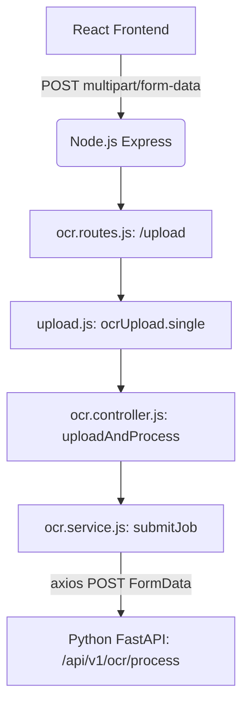

# The RAG Document Processing Pipeline

This document is an exhaustive, first-principles deep dive into the Document Loader and Processing Pipeline of the CapitalScale underwriting platform. It is designed to teach you the complete ingestion flow as if you were being mentored by the Principal Architect, fully preparing you for senior-level engineering interviews.

---

## PART 1 - THE ENTRY POINT

The ingestion pipeline begins when a user uploads a document via the frontend.

### The Execution Flow



### 1. The Route
**File:** `backend/src/routes/v1/ocr.routes.js`
```javascript
router.post('/upload', ocrUpload.single('file'), uploadAndProcess);
```
**Why it exists:** Provides the HTTP boundary for the client to push files into the system.
**Authentication:** Protected by a `protect` JWT middleware further up the router chain.

### 2. The File Upload Middleware
**File:** `backend/src/routes/v1/ocr.routes.js` & `multer`
```javascript
const ocrUpload = multer({
  storage: multer.memoryStorage(),
  limits: { fileSize: 50 * 1024 * 1024 }, // 50MB
  fileFilter: (_req, file, cb) => {
    if (OCR_ALLOWED_MIMES.includes(file.mimetype)) cb(null, true);
    else cb(ApiError.badRequest(...));
  }
});
```
**Why it exists:** Safely buffers the incoming binary stream into RAM instead of saving to disk, drastically speeding up intra-service proxying. It drops files >50MB to prevent DoS attacks.
**Input:** Binary stream.
**Output:** Mutates `req` by attaching `req.file.buffer`.
**If it fails:** Throws an Express error before reaching the controller.

### 3. The Controller
**File:** `backend/src/controllers/ocr.controller.js`
```javascript
export const uploadAndProcess = asyncHandler(async (req, res) => {
  if (!req.file) throw new ApiError(400, 'No file uploaded');
  const job = await OcrService.submitJob({
    fileBuffer: req.file.buffer,
    filename: req.file.originalname,
    mimeType: req.file.mimetype,
    ...req.body
  });
  return ApiResponse.created(job, 'Document queued').send(res);
});
```
**Why it exists:** Validates the presence of the file, sanitizes `req.body`, and delegates to the Service. 

### 4. The Service (Handoff to Python)
**File:** `backend/src/services/ocr.service.js`
```javascript
async submitJob({ fileBuffer, filename, mimeType, ... }) {
  // 1. Database Tracking
  const job = await this.ocrRepo.createJob({...});
  
  // 2. FormData Proxy
  const formData = new FormData();
  formData.append('file', fileBuffer, { filename, contentType: mimeType });
  formData.append('job_id', job.job_id);
  
  // 3. HTTP Call to Python Microservice
  await this.aiClient.processOcr(formData);
  return job;
}
```
**Why it exists:** Node.js is single-threaded and terrible at CPU-heavy OCR. The service acts as an API Gateway proxy, instantly recording the job in PostgreSQL and streaming the `fileBuffer` over internal HTTP to the Python AI service.

---

## PART 2 - THE DOCUMENT LOADER

Once the payload hits Python, it enters the core Document Loader.

**File:** `ai-services-python/services/ocr/document_loader.py`
**Function:** `process_document(file_bytes: bytes, filename: str, mime_type: str) -> DocumentResult`

### Why this component exists
`process_document` acts as the Traffic Cop. Its sole responsibility is to look at the file's extension and MIME type and route the bytes to the correct mathematical extraction engine.

### Which modules it calls
- `PdfPlumberExtractor` (for native PDFs)
- `PaddleOcrExtractor` (for Images)
- `ScannedPdfOcrExtractor` (for scanned PDFs)
- `UnstructuredFallbackExtractor` (for unknowns)

### Why the architecture is designed this way
By adhering to the **Open/Closed Principle (SOLID)**, the system defines an abstract `DocumentExtractor` interface. `process_document` simply instantiates the correct strategy. If we need to add `.docx` support later, we build a new `DocxExtractor` without modifying the core chunking pipelines.

```python
# Code snippet: process_document
async def process_document(file_bytes: bytes, filename: str, mime_type: str) -> DocumentResult:
    ext = Path(filename).suffix.lower()
    
    if mime_type.startswith("image/") or ext in [".png", ".jpg"]:
        extractor = PaddleOcrExtractor()
        result = await extractor.extract(file_bytes, filename)
        
    elif mime_type == "application/pdf" or ext == ".pdf":
        fallback = ScannedPdfOcrExtractor()
        extractor = PdfPlumberExtractor(fallback_extractor=fallback)
        result = await extractor.extract(file_bytes, filename)
        
    return result
```

---

## PART 3 - COMPLETE EXECUTION TRACE

Let's trace a PDF upload until it reaches the chunker.

1. **`React`**: `fetch('/api/v1/ocr/upload', { method: 'POST', body: formData })`
2. **`Express.ocrUpload.single('file')`**: Reads binary stream into `req.file.buffer`.
3. **`Express.uploadAndProcess()`**: Destructures metadata, calls Service.
4. **`Express.OcrService.submitJob()`**: `INSERT INTO ocr_jobs`.
5. **`Express.aiClient.processOcr()`**: `axios.post('http://python:8000/process', formData)`
6. **`FastAPI.upload_file()`**: Receives bytes, calls `OcrQueue.enqueue()`.
7. **`Python Worker Loop`**: Dequeues job, calls `document_loader.process_document()`.
8. **`document_loader.process_document()`**: Detects MIME `application/pdf`, instantiates `PdfPlumberExtractor`.
9. **`PdfPlumberExtractor.extract()`**: Wraps synchronous extraction in `asyncio.to_thread(self._extract_sync)`.
10. **`PdfPlumberExtractor._extract_sync()`**: 
    - Loads PDF into RAM via `pdfplumber.open()`.
    - Iterates pages calling `page.extract_text()` and `page.extract_tables()`.
    - Converts tables to Markdown.
    - Calculates text density (`_page_confidence`).
11. **`document_loader.process_document()`**: Returns populated `DocumentResult`.
12. **`ocr_queue._process_job()`**: Takes `DocumentResult`, passes it to `build_document_chunks()` to begin chunking.

---

## PART 4 - DECISION MAKING (NATIVE VS SCANNED)

The most critical decision happens in `PdfPlumberExtractor._extract_sync`. 

**How the code decides:**
A PDF can be "native" (text characters embedded in the code) or "scanned" (just an image of a paper inside a PDF wrapper). `pdfplumber` can only read native text.

**Variables Checked:**
```python
native_chars += len(text)
avg_chars_per_page = native_chars / result.page_count
```

**Thresholds:**
```python
MIN_NATIVE_TEXT_DENSITY = 50

if avg_chars_per_page >= MIN_NATIVE_TEXT_DENSITY:
    result.pdf_type = "native"
    return result
```

**What happens if it fails?**
If `avg_chars_per_page < 50` (e.g., a scanned PDF returning 0 characters), the method returns a `DocumentResult` but leaves `pdf_type` unset.

**Fallback Logic:**
Back in the async `extract` wrapper:
```python
if result.pdf_type == "native":
    return result
if self.fallback_extractor: # ScannedPdfOcrExtractor
    logger.info("Scanned PDF detected. Delegating to fallback...")
    return await self.fallback_extractor.extract(file_bytes, filename)
```
The architecture seamlessly hands the bytes over to the machine learning `PaddleOCR` pipeline to extract text from the pixels.

---

## PART 5 - DATA FLOW

Watch the object mutate as it flows through the pipeline:

1. **`File` (Browser)**
   *(Binary File)*
   ↓
2. **`req.file.buffer` (Node.js)**
   *(Raw RAM Buffer)*
   ↓
3. **`FormData` (Axios)**
   *(Multipart HTTP Stream)*
   ↓
4. **`file_bytes` (FastAPI)**
   *(Python `bytes` object)*
   ↓
5. **`page.extract_text()` (pdfplumber)**
   *(Raw Python String)*
   ↓
6. **`DocumentResult` (Document Loader)**
   *(Structured Pydantic Model containing raw text, markdown tables, word counts, and page stats)*
   ↓
7. **`ChunkingContext` (Chunking Factory)**
   *(Wrapper combining `DocumentResult` with Database Metadata like `job_id` and `application_id`)*

---

## PART 6 - OUTPUT OF DOCUMENT LOADER

The loader spits out a single unified data structure, regardless of whether `pdfplumber` or `PaddleOCR` did the work.

**Class:** `DocumentResult`
```python
class DocumentResult:
    pdf_type: str            # "native", "scanned", or "image" - dictates confidence levels downstream
    raw_text: str            # The massive, raw, concatenated text of the entire document
    page_count: int          # Used for billing/progress tracking
    word_count: int          # Used for token estimation
    char_count: int          # Used for chunk boundaries
    confidence_score: float  # Used to flag documents for "Manual Admin Review" if OCR fails
    processing_time_ms: int  # For telemetry
    page_results: list[PageResult] # Array holding exact text/stats per page
```

---

## PART 7 - DESIGN DECISIONS

### Why didn't we call PaddleOCR directly from the Node controller?
**Answer:** PaddleOCR is a heavy deep-learning model requiring PyTorch/PaddlePaddle. Node.js is V8 JavaScript, optimized for fast, asynchronous I/O, not Matrix Multiplication. Bridging them natively would crash the Node process.

### Why normalize the output into `DocumentResult`?
**Answer:** **Liskov Substitution Principle (SOLID)**. The Chunking and Embedding modules do not care if the text came from a PDF, an image, or a text file. By normalizing into `DocumentResult`, the downstream chunker operates strictly on an interface.

### Why separate extraction from chunking?
**Answer:** **Single Responsibility Principle (SOLID)**. Extraction is concerned with bytes, OCR models, and file formats. Chunking is concerned with NLP, tokens, semantics, and LLM context limits. Mixing them creates unmaintainable monolithic code.

### Why is this maintainable?
Because every piece is decoupled. If we want to replace `pdfplumber` with `PyMuPDF` tomorrow, we just write a new class implementing `DocumentExtractor.extract()`. The rest of the pipeline remains entirely untouched.

---

## PART 8 - EDGE CASES

How our pipeline handles real-world chaos:

*   **Empty PDF:** Handled. `pdfplumber` returns 0 chars. Fallback triggers. Fallback returns 0 chars. System skips vectorization.
*   **Corrupted PDF:** Handled. `pdfplumber.open()` throws a `pdfminer` exception. Caught by the Python worker loop; job marked as `failed` in the DB.
*   **Password protected PDF:** Handled. Caught by exception handler.
*   **Native extraction failure (Image PDF):** Handled via `avg_chars_per_page < 50` threshold fallback to `PaddleOCR`.
*   **50MB+ Large document:** Handled by Node.js `multer` limits. Request rejected at Gateway immediately.
*   **Duplicate upload:** Unhandled at ingestion. Handled at Vector DB layer via idempotent `DELETE FROM document_chunks WHERE source_document = $1` before `INSERT`.
*   **Missing pages:** If OCR fails on page 3 but succeeds on page 4, the text just continues. Partial data loss is silently passed to chunking (a known limitation of OCR).

---

## PART 9 - INTERVIEW QUESTIONS

**Interviewer:** *"You mentioned Node.js streams the file via FormData to Python. Why did you use `multer.memoryStorage()`? If 100 users upload 50MB PDFs simultaneously, you'll consume 5GB of RAM and crash the Node container. Why didn't you stream it?"*
**Answer:** "You are absolutely correct. Our current `memoryStorage` is a bottleneck designed for MVP simplicity. In a true enterprise environment, this is a fatal flaw. To scale this, I would bypass Node.js entirely: the React client should request a Pre-signed S3 URL from Node, upload the 50MB PDF directly to AWS S3, and then S3 triggers an AWS SQS message to the Python worker containing the file path. Node.js shouldn't touch the bytes at all."

**Interviewer:** *"In `PdfPlumberExtractor`, you wrap the extraction in `asyncio.to_thread()`. Why?"*
**Answer:** "FastAPI runs on an `asyncio` event loop. `pdfplumber` is a synchronous, CPU-bound library. If I called it directly, the event loop would block. No other HTTP requests could be processed by FastAPI for the 5 seconds it takes to parse the PDF. `to_thread()` pushes the work to a separate OS thread in the ThreadPoolExecutor, allowing FastAPI to continue serving other async endpoints while the PDF parses."

**Interviewer:** *"How would you handle a 500-page PDF?"*
**Answer:** "Currently, our worker processes it synchronously in memory, which would likely OOM (Out of Memory) the container. To handle 500 pages, I would implement a Map-Reduce pattern. I'd split the PDF into 50 chunks of 10 pages, push 50 separate jobs onto a Redis queue, have a fleet of Python workers OCR them in parallel, and then trigger a 'Reduce' job to stitch the `DocumentResult` back together."

---

## PART 10 - IMPROVEMENTS

### Current Implementation vs Recommended Production Architecture

**The Good:**
- Excellent decoupling via the `DocumentExtractor` abstract classes.
- Robust fallback logic from native to OCR without failing.
- Strong domain-driven design separating Loader, Chunker, and Vectorizer.

**The Bad (Scalability & Performance Bottlenecks):**
1. **Memory Bloat:** `multer.memoryStorage()` in Node.js limits horizontal scalability.
2. **Synchronous Internal Network:** Passing 50MB binary blobs over internal HTTP (`axios.post`) between microservices is incredibly inefficient and increases network egress costs.
3. **Queue Bottlenecks:** Using PostgreSQL (`ocr_jobs` table) as a task queue is an anti-pattern. While it works for MVP, long-polling SQL tables causes database lock contention.

**Production Recommendations:**
1. **Move to Presigned URLs:** React -> S3. Python reads directly from S3.
2. **Move to Redis/Celery:** Replace the PostgreSQL polling queue with a proper message broker (RabbitMQ or Redis) for the Python workers.
3. **Stream Chunking:** Instead of holding the massive `raw_text` string in memory for the entire document, yield chunks lazily as pages are processed to reduce the memory footprint.
